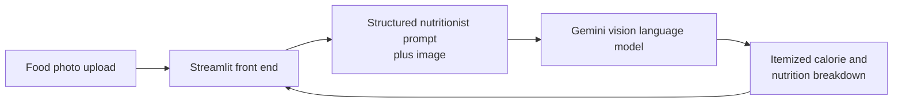

# Nutrition Vision App: Multimodal Food Analysis with Gemini

Upload a photo of your food and get an itemized calorie and nutrition breakdown, powered by the Gemini vision language model.

**Live demo:** https://nutrition-gemini.streamlit.app/

## Architecture

## How it works

1. A Streamlit front end accepts a food image
2. The image plus a structured nutritionist prompt are sent to the Gemini vision API
3. The model identifies the food items and returns itemized calorie and nutrition insights as structured output

## Stack

Gemini (vision) · Streamlit · Python · PIL
